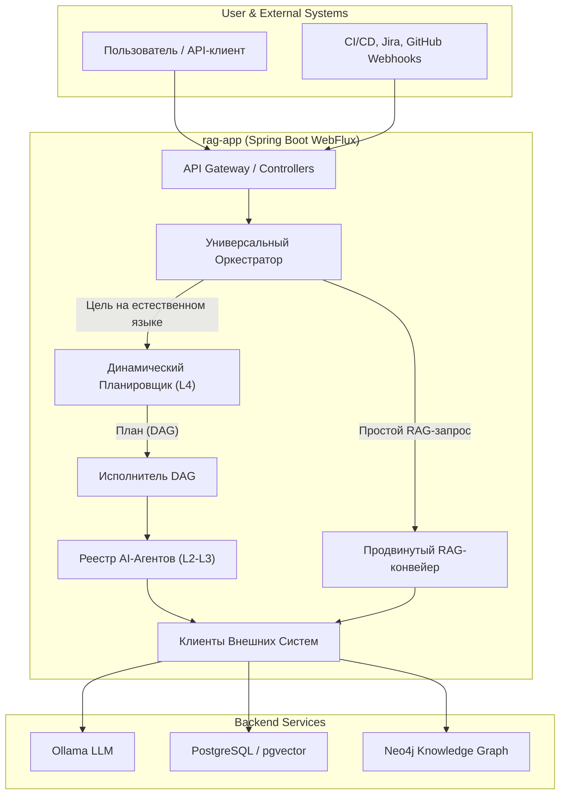

# Платформа автономных AI-Агентов для SDLC и QA

Настоящий проект представляет собой **промышленную (production-grade) платформу** для интеграции, оркестрации и
эксплуатации автономных AI-агентов в жизненном цикле разработки и обеспечения качества ПО (SDLC & QA). Система
реализована на Spring Boot 3.3+ (WebFlux) и Java 21.

Это не просто RAG-прототип, а комплексное решение, построенное на state-of-the-art архитектурных паттернах, включающее в
себя:

* **Иерархию автономных AI-агентов (L2-L5)**, способных решать задачи от анализа кода до стратегического планирования.
* **Продвинутый, многоступенчатый RAG-конвейер**, реализующий передовые техники для максимальной точности и минимизации
  галлюцинаций.
* **Полный MLOps-цикл для базы знаний**, включая CI/CD, мониторинг дрейфа и автоматическое пополнение регрессионных
  тестов из фидбэка.
* **Динамическую оркестрацию**, позволяющую на лету строить планы выполнения (DAG) из доступных инструментов для
  достижения высокоуровневых целей.

Система использует локально развернутые LLM через Ollama, векторную базу данных `pgvector` и графовую базу данных
`Neo4j` для построения графов знаний.

## Ключевые архитектурные принципы

1. **Агент-ориентированная Архитектура:** Иерархия AI-агентов разного уровня (от "инструментов" L2 до "AI-губернаторов"
   L5) позволяет декомпозировать сложные задачи и создавать гибкие, переиспользуемые компоненты.
2. **Динамическая Оркестрация (DAG Execution):** Вместо статичных конвейеров, система включает в себя AI-планировщик (
   `WorkflowPlannerAgent`), который строит граф зависимостей (DAG) из доступных агентов для достижения цели, заданной на
   естественном языке. Это позволяет выполнять независимые задачи параллельно.
3. **Explainable AI (XAI) & Human-in-the-Loop:** Ключевые компоненты способны объяснять свои действия (
   `ExplainerAgent`), а критически важные операции (создание тикетов, запуск CI, откат релиза) требуют явного
   утверждения человеком через специальный API.
4. **Полный MLOps-цикл для Базы Знаний:** База знаний рассматривается как критически важный артефакт, управляемый по тем
   же принципам, что и код:
    * **CI/CD для Знаний:** Автоматический прогон тестов по "золотому датасету" после каждой индексации для
      предотвращения регрессий (`knowledge-ci-cd-pipeline`).
    * **Мониторинг Дрейфа:** Автоматическое обнаружение изменений в embedding-модели для своевременной переиндексации.
    * **Проактивное Курирование:** Фоновые AI-агенты (`KnowledgeGuardianAgent`) постоянно проверяют базу знаний на
      внутренние противоречия и предлагают улучшения.

## Архитектурная диаграмма



## The RAG Pipeline: От запроса до проверенного ответа

Система реализует многоступенчатый RAG-конвейер, значительно превосходящий стандартные реализации:

1. **Безопасность на входе (Input Guardrails):** `PromptGuardStep` анализирует каждый запрос на предмет **Prompt
   Injection** и блокирует потенциальные атаки.
2. **Обработка Запроса:** `QueryProcessingPipeline` применяет каскад техник:
    * **Hypothetical Document Embeddings (HyDE):** Генерирует "идеальный" ответ на вопрос для более точного
      семантического поиска.
    * **Multi-Query & Step-Back:** Создает несколько вариантов запроса для повышения полноты поиска.
3. **Рефлексивный Поиск (Self-Correcting Retrieval):** `ReflectiveRetrieverAgent` выполняет гибридный поиск (векторный +
   FTS), а затем **AI-Критик** оценивает найденные документы. Если они нерелевантны, агент переформулирует запрос и ищет
   снова.
4. **Расширение Контекста (Context Expansion):**
    * **Graph RAG:** `GraphExpansionStep` обращается к Neo4j, чтобы найти связанные сущности (тесты, требования) и
      обогатить ими контекст.
    * **Parent Document Retriever:** `ContextExpansionStep` заменяет найденные точные "дочерние" чанки на их полные "
      родительские" документы, решая проблему "потерянного в середине" контекста.
5. **Продвинутое Переранжирование (Reranking):**
    * **MMR (Maximal Marginal Relevance):** `DiversityRerankingStrategy` повышает разнообразие документов в контексте,
      борясь с избыточностью.
    * **Cross-Encoder Reranker:** Финальная сортировка по релевантности с помощью мощной локальной модели (DJL/PyTorch).
6. **Генерация с "Цепочкой Мысли" (Chain-of-Thought Generation):**
    * Финальный промпт заставляет LLM сначала извлечь все релевантные факты со ссылками на источники, и только потом на
      их основе синтезировать ответ.
7. **Валидация на выходе (Output Guardrails):**
    * **AI-Критик (`ResponseValidationStep`):** "Независимый" AI-агент проверяет сгенерированный ответ на предмет
      галлюцинаций, полноты и корректности цитат.
    * **Trust Score:** Для каждого ответа вычисляется "Оценка Доверия", которая возвращается клиенту через API.

## Каталог агентов

| Уровень | Агент / Конвейер | Назначение |
|:--- |:--- |:--- |
| **L5 (Губернаторы)** | **AI CTO / Executive Governor** | Анализирует здоровье всех проектов в портфеле и формирует стратегический технический роадмап. |
| | **AI VP of Engineering** | Анализирует метрики SDLC (DORA, Git) и предлагает улучшения для инженерных процессов. |
| | **AI CFO / ROI Analyst** | Анализирует затраты (инфраструктура, LLM, разработка) и рассчитывает ROI для инженерных инициатив. |
| **L4 (Оркестраторы)** | **QA Copilot** | Stateful-ассистент, управляющий диалогом и динамическим выполнением задач. |
| | **Root Cause Analyzer** | Проводит комплексный анализ первопричины падений тестов, синтезируя данные из логов, diff'ов и отчетов. |
| | **Incident Commander** | Реагирует на алерты мониторинга, проводит триаж и запускает план по сдерживанию инцидента (например, откат релиза). |
| | **Knowledge Consistency Guardian** | Проактивно проверяет базу знаний на внутренние противоречия между различными источниками. |
| **L3 (Специалисты)**| **SAST & RBAC Security Agents** | Выполняют статический анализ кода на уязвимости (OWASP) и ошибки в конфигурации прав доступа. |
| | **Test Debt Analyzer** | Анализирует историю прогонов для выявления "flaky" и медленных тестов, формируя отчет о техдолге. |
| | **Knowledge Gap Advisor** | Анализирует запросы без ответа и предлагает темы для новой документации. |
| | **Performance Predictor** | Прогнозирует влияние изменений в коде на производительность (latency, CPU, memory). |
| | **UX Heuristics Evaluator**| Оценивает HTML-код на соответствие 10 эвристикам юзабилити Якоба Нильсена. |
| **L2 (Инструменты)**| **Git Inspector** | Извлекает из Git список измененных файлов, diff'ы и историю коммитов. |
| | **Code Parser** | Выполняет AST-анализ Java-кода для извлечения его структуры. |
| | **Web Crawler** | Извлекает текстовый контент с внешних веб-страниц для анализа. |
| | **Jira Ticket Creator**| Создает тикет в Jira (требует утверждения человеком). |
| | **CI Trigger**| Запускает задачу в CI/CD системе (требует утверждения человеком). |

## Стек технологий

| Категория | Технология | Назначение |
|:--- |:--- |:--- |
| **Core** | Java 21 & Spring Boot 3.3+ (WebFlux) | Основной фреймворк и язык. |
| **AI & Agents** | Spring AI, Ollama, DJL/PyTorch | Интеграция с LLM, векторными хранилищами, локальными ML-моделями. |
| **Базы Данных** | PostgreSQL + `pgvector`, Neo4j | Реляционное, векторное и графовое хранилище. |
| **Надежность** | Resilience4j | Реализация паттернов Circuit Breaker, Retry, TimeLimiter. |
| **Наблюдаемость**| Actuator, Micrometer, Prometheus | Мониторинг состояния и сбор метрик. |
| **Тестирование** | JUnit 5, Mockito, Testcontainers, Awaitility | Unit- и интеграционное тестирование. |
| **Инструменты** | JGit, PMD, JavaParser, Playwright | Анализ кода и UI-автоматизация. |

## Быстрый старт

### Предварительные требования

1. **Docker и Docker Compose**
2. **Java 21+ SDK**
3. **Git**

### Запуск и настройка

1. **Клонируйте репозиторий:**
   ```bash
   git clone https://github.com/svedentsov/rag-ollama-service.git
   cd rag-ollama-service
   ```

2. **Запустите всю инфраструктуру:**
   Эта команда соберет образ приложения и запустит все контейнеры (`rag-app`, `postgres`, `ollama`, `neo4j`).
   ```bash
   docker-compose up --build -d
   ```

3. **Загрузите LLM-модели в Ollama:**
   ```bash
   # Модель для сбалансированных задач (RAG, чат, планирование)
   docker exec -it rag-ollama ollama pull llama3

   # Быстрая модель для классификации и рутинга
   docker exec -it rag-ollama ollama pull phi3

   # Модель для эмбеддингов
   docker exec -it rag-ollama ollama pull mxbai-embed-large
   ```
   *Имена моделей можно изменить в `application.yml` в секции `app.llm.models`.*

4. **Проверьте, что сервисы запущены:**
   ```bash
   docker ps
   curl http://localhost:8080/actuator/health
   ```
   Ожидаемый ответ: `{"status":"UP"}`.

## Использование API

Основной точкой входа является **Универсальный Оркестратор**, который автоматически определяет намерение пользователя и
запускает соответствующий конвейер.

1. **Откройте Swagger UI в браузере:**
   [http://localhost:8080/swagger-ui.html](http://localhost:8080/swagger-ui.html)

2. **Используйте эндпоинт `POST /api/v1/workflows/execute` для сложных задач:**
   Этот эндпоинт позволяет задать цель на естественном языке. AI-планировщик сам построит и выполнит план для ее
   достижения.

    * **Пример: Полный аудит безопасности для изменений**
     ```json
     {
       "goal": "Проведи полный аудит безопасности для изменений между main и feature/new-security-logic",
       "initialContext": {
         "oldRef": "main",
         "newRef": "feature/new-security-logic",
         "privacyPolicy": "Запрещено логировать PII (email, имя, телефон)."
       }
     }
     ```
   В ответе вы получите агрегированный отчет от `SecurityReportAggregatorAgent`.

3. **Используйте эндпоинт `POST /api/v1/orchestrator/ask-stream` для RAG-запросов:**
   Этот эндпоинт оптимален для чат-интерфейсов и RAG-запросов, так как возвращает ответ в потоковом режиме.
    * **Пример: Простой RAG-запрос**
     ```json
     {
       "query": "Сколько дней отпуска положено сотрудникам в год?"
     }
     ```
   Ответ будет приходить по частям (SSE), включая сгенерированный текст и список источников.
