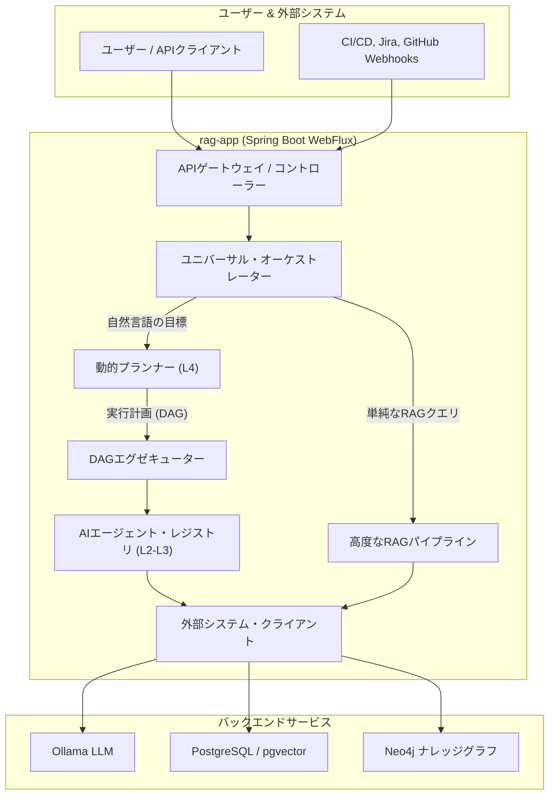

# SDLC & QAのための自律型AIエージェントプラットフォーム

本プロジェクトは、ソフトウェア開発ライフサイクル（SDLC）および品質保証（QA）に自律型AIエージェントを統合、オーケストレーション、運用するための
**プロダクショングレードのプラットフォーム**です。システムはSpring Boot 3.3+（WebFlux）およびJava 21で実装されています。

これは単なるRAGのプロトタイプではなく、最先端のアーキテクチャパターンに基づいて構築された包括的なソリューションであり、以下の機能を含みます：

* コード解析から戦略的計画までを担う**自律型AIエージェントの階層（L2-L5）**。
* 最高の精度を実現し、ハルシネーションを最小化するための高度な技術を実装した、**先進的な多段階RAGパイプライン**。
* ナレッジベースのための**完全なMLOpsサイクル**。CI/CD、ドリフト監視、フィードバックからの回帰テストの自動拡充を含みます。
* 利用可能なツールから実行計画（DAG）を動的に構築し、高レベルな目標を達成するための**動的オーケストレーション**。

このシステムは、Ollamaを介してローカルにデプロイされたLLM、ベクトルデータベース`pgvector`、およびナレッジグラフを構築するためのグラフデータベース
`Neo4j`を使用します。

## 主要なアーキテクチャ原則

1. **エージェント指向アーキテクチャ:** 異なるレベルのAIエージェント階層（L2「ツール」からL5「AIガバナー」まで）により、複雑なタスクを分解し、柔軟で再利用可能なコンポーネントを作成できます。
2. **動的オーケストレーション（DAG実行）:** 静的なパイプラインの代わりに、システムにはAIプランナー（`WorkflowPlannerAgent`
   ）が含まれており、自然言語で指定された目標を達成するために、利用可能なエージェントから依存関係グラフ（DAG）を構築します。これにより、独立したタスクの並列実行が可能になります。
3. **説明可能なAI（XAI） & Human-in-the-Loop:** 主要コンポーネントはそのアクションを説明でき（`ExplainerAgent`
   ）、重要な操作（チケット作成、CI実行、リリースロールバック）は専用APIを介した人間の明示的な承認を必要とします。
4. **ナレッジベースのための完全なMLOpsサイクル:** ナレッジベースは、コードと同じ原則で管理される重要な成果物と見なされます。
    * **ナレッジCI/CD:** リグレッションを防ぐため、インデックス作成ごとに「ゴールデンデータセット」に対するテストを自動実行します（
      `knowledge-ci-cd-pipeline`）。
    * **ドリフト監視:** 埋め込みモデルの変更を自動検出し、タイムリーな再インデックス作成をトリガーします。
    * **プロアクティブなキュレーション:** バックグラウンドAIエージェント（`KnowledgeGuardianAgent`
      ）がナレッジベース内の矛盾を常にチェックし、改善を提案します。

## アーキテクチャ図



## RAGパイプライン：クエリから検証済み回答まで

このシステムは、標準的な実装を大幅に上回る多段階RAGパイプラインを実装しています：

1. **入力ガードレール:** `PromptGuardStep`が各クエリを**プロンプトインジェクション**の観点から分析し、潜在的な攻撃をブロックします。
2. **クエリ処理:** `QueryProcessingPipeline`が以下の技術を適用します：
    * **HyDE (Hypothetical Document Embeddings):** より正確なセマンティック検索のために、質問に対する「理想的な」回答を生成します。
    * **Multi-Query & Step-Back:** 検索のカバレッジを高めるために、複数のクエリバリエーションを作成します。
3. **自己修正型検索 (Self-Correcting Retrieval):** `ReflectiveRetrieverAgent`がハイブリッド検索（ベクトル+FTS）を実行し、その後
   **AI評論家**が取得したドキュメントを評価します。関連性が低い場合、エージェントはクエリを再構成して再度検索します。
4. **コンテキスト拡張:**
    * **Graph RAG:** `GraphExpansionStep`がNeo4jにクエリを発行し、関連エンティティ（テスト、要件）を見つけてコンテキストを拡充します。
    * **Parent Document Retriever:** `ContextExpansionStep`が取得した正確な「子」チャンクを、その完全な「親」ドキュメントに置き換えることで、「文脈の喪失」問題を解決します。
5. **高度な再ランキング:**
    * **MMR (Maximal Marginal Relevance):** `DiversityRankingStrategy`がコンテキスト内のドキュメントの多様性を高め、冗長性を低減します。
    * **Cross-Encoder Reranker:** 強力なローカルモデル（DJL/PyTorch）を使用して、最終的な関連性に基づいたソートを行います。
6. **思考の連鎖 (Chain-of-Thought) 生成:**
    * 最終プロンプトは、LLMにまず全ての関連事実を情報源への引用付きで抽出し、その後にそれらに基づいて回答を統合させます。
7. **出力ガードレール:**
    * **AI評論家 (`ResponseValidationStep`):** 「独立した」AIエージェントが、生成された回答のハルシネーション、完全性、引用の正確性を検証します。
    * **信頼スコア:** 各回答に対して「信頼スコア」が計算され、API経由でクライアントに返されます。

## エージェントカタログ

| レベル | エージェント / パイプライン | 目的 |
|:--- |:--- |:--- |
| **L5 (ガバナー)** | **AI CTO / Executive Governor** | ポートフォリオ内の全プロジェクトの健全性を分析し、戦略的な技術ロードマップを策定する。 |
| | **AI VP of Engineering** | SDLCメトリクス（DORA, Git）を分析し、エンジニアリングプロセスの改善を提案する。 |
| | **AI CFO / ROI Analyst** | コスト（インフラ、LLM、開発）を分析し、エンジニアリング施策のROIを計算する。 |
| **L4 (オーケストレーター)** | **QA Copilot** | 対話を管理し、動的なタスク実行を行うステートフルなアシスタント。 |
| | **Root Cause Analyzer** | ログ、diff、レポートからデータを統合し、テスト失敗の根本原因を包括的に分析する。 |
| | **Incident Commander** | 監視アラートに対応し、インシデントをトリアージし、封じ込め計画（例：リリースロールバック）を開始する。 |
| | **Knowledge Consistency Guardian** | ナレッジベース内の異なる情報源間の内部矛盾をプロアクティブにチェックする。 |
| **L3 (スペシャリスト)**| **SAST & RBAC Security Agents** | 脆弱性（OWASP）やアクセス制御設定のエラーについて静的コード解析を実行する。 |
| | **Test Debt Analyzer** | テスト実行履歴を分析し、「flaky」テストや遅いテストを特定し、技術的負債レポートを作成する。 |
| | **Knowledge Gap Advisor** | 回答が見つからなかったクエリを分析し、新しいドキュメントのトピックを提案する。 |
| | **Performance Predictor** | コード変更がパフォーマンス（レイテンシ、CPU、メモリ）に与える影響を予測する。 |
| | **UX Heuristics Evaluator**| ヤコブ・ニールセンの10のユーザビリティヒューリスティクスに基づいてHTMLコードを評価する。 |
| **L2 (ツール)**| **Git Inspector** | Gitから変更されたファイルのリスト、diff、コミット履歴を抽出する。 |
| | **Code Parser** | JavaコードのAST解析を実行し、その構造を抽出する。 |
| | **Web Crawler** | 外部のウェブページからテキストコンテンツを抽出して分析する。 |
| | **Jira Ticket Creator**| Jiraにチケットを作成する（人間の承認が必要）。 |
| | **CI Trigger**| CI/CDシステムでジョブをトリガーする（人間の承認が必要）。 |

## 技術スタック

| カテゴリ | 技術 | 目的 |
|:--- |:--- |:--- |
| **コア** | Java 21 & Spring Boot 3.3+ (WebFlux) | 主要なフレームワークと言語。 |
| **AI & エージェント** | Spring AI, Ollama, DJL/PyTorch | LLM、ベクトルストア、ローカルMLモデルとの統合。 |
| **データベース** | PostgreSQL + `pgvector`, Neo4j | リレーショナル、ベクトル、グラフストレージ。 |
| **信頼性** | Resilience4j | サーキットブレーカー、リトライ、タイムリミッターパターンの実装。 |
| **可観測性**| Actuator, Micrometer, Prometheus | 状態監視とメトリクス収集。 |
| **テスト** | JUnit 5, Mockito, Testcontainers, Awaitility | ユニットテストおよび統合テスト。 |
| **ツール** | JGit, PMD, JavaParser, Playwright | コード解析とUI自動化。 |

## クイックスタート

### 前提条件

1. **DockerとDocker Compose**
2. **Java 21+ SDK**
3. **Git**

### 起動と設定

1. **リポジトリをクローンする:**
   ```bash
   git clone https://github.com/svedentsov/rag-ollama-service.git
   cd rag-ollama-service
   ```

2. **インフラ全体を起動する:**
   このコマンドはアプリケーションイメージをビルドし、全てのコンテナ（`rag-app`, `postgres`, `ollama`, `neo4j`）を起動します。
   ```bash
   docker-compose up --build -d
   ```

3. **LLMモデルをOllamaにプルする:**
   ```bash
   # バランスの取れたタスク（RAG、チャット、計画）向けのモデル
   docker exec -it rag-ollama ollama pull llama3

   # 分類やルーティング向けの高速モデル
   docker exec -it rag-ollama ollama pull phi3

   # 埋め込み用のモデル
   docker exec -it rag-ollama ollama pull mxbai-embed-large
   ```
   *モデル名は `application.yml` の `app.llm.models` セクションで変更可能です。*

4. **サービスが起動していることを確認する:**
   ```bash
   docker ps
   curl http://localhost:8080/actuator/health
   ```
   期待される応答: `{"status":"UP"}`。

## APIの使用方法

主要なエントリポイントは**ユニバーサル・オーケストレーター**で、ユーザーの意図を自動的に判断し、適切なパイプラインを起動します。

1. **ブラウザでSwagger UIを開く:**
   [http://localhost:8080/swagger-ui.html](http://localhost:8080/swagger-ui.html)

2. **複雑なタスクには `POST /api/v1/workflows/execute` エンドポイントを使用する:**
   このエンドポイントでは、自然言語で目標を指定できます。AIプランナーがその達成のための計画を自ら構築し、実行します。

    * **例：変更に対する完全なセキュリティ監査**
     ```json
     {
       "goal": "Perform a full security audit for the changes between main and feature/new-security-logic",
       "initialContext": {
         "oldRef": "main",
         "newRef": "feature/new-security-logic",
         "privacyPolicy": "It is forbidden to log PII (email, name, phone)."
       }
     }
     ```
   応答として、`SecurityReportAggregatorAgent`からの集約レポートを受け取ります。

3. **RAGクエリには `POST /api/v1/orchestrator/ask-stream` エンドポイントを使用する:**
   このエンドポイントはストリーミングモードで応答を返すため、チャットインターフェースやRAGクエリに最適です。
    * **例：単純なRAGクエリ**
     ```json
     {
       "query": "従業員は年間何日の休暇を取得できますか？"
     }
     ```
   応答はチャンク（SSE）で配信され、生成されたテキストと情報源のリストが含まれます。
